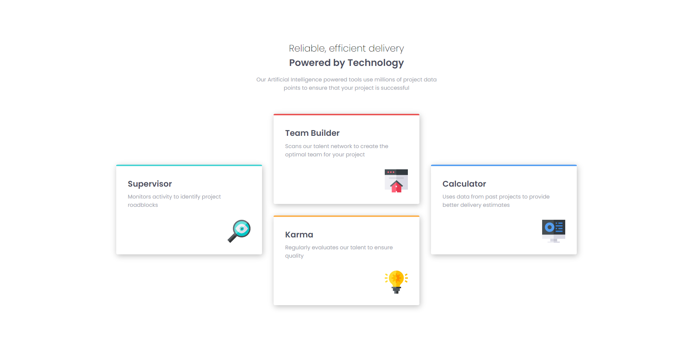

# Frontend Mentor - Four card feature section solution

This is a solution to the [Four card feature section challenge on Frontend Mentor](https://www.frontendmentor.io/challenges/four-card-feature-section-weK1eFYK). Frontend Mentor challenges help you improve your coding skills by building realistic projects. 

## Table of contents

- [Overview](#overview)
  - [The challenge](#the-challenge)
  - [Screenshot](#screenshot)
  - [Links](#links)
- [My process](#my-process)
  - [Built with](#built-with)
  - [What I learned](#what-i-learned)

## Overview

### The challenge

Users should be able to:

- View the optimal layout for the site depending on their device's screen size

### Screenshot

### Links

- [Solution URL](https://github.com/jma26/Four-Card-Feature-FE-Mentor-8)
- [Live Site URL](https://jma26.github.io/Four-Card-Feature-FE-Mentor-8/)

## My process

### Built with

- HTML
- Flexbox
- CSS Grid

### What I learned

This challenge was similar to my previous challenges. I wanted to make sure that I was not losing touch on CSS Grid and utilizing best practices for semantic HTML since it's been awhile I've completed a challenge (new job so not a lot of free time!)